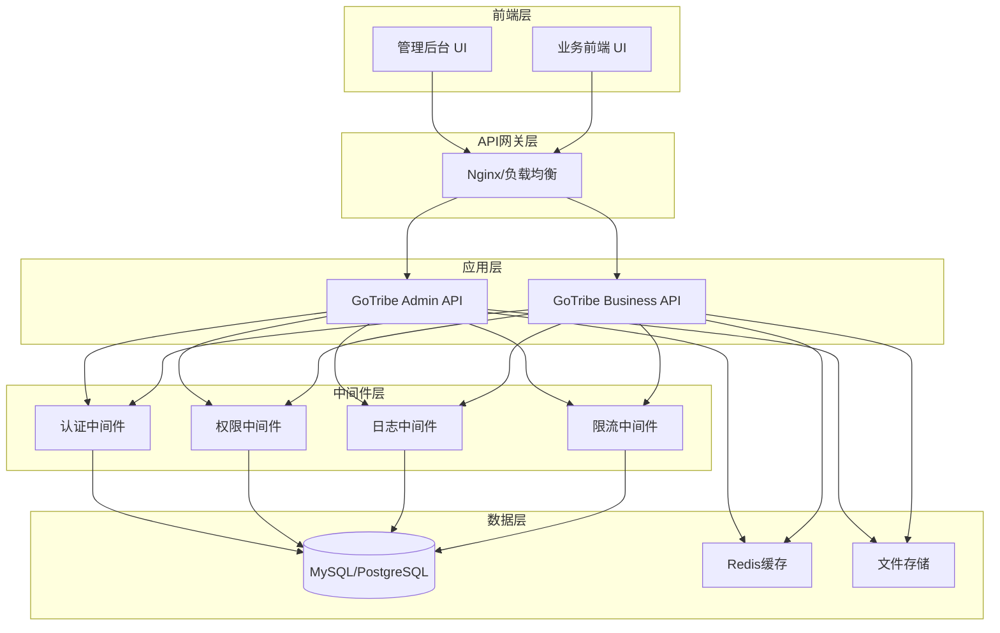
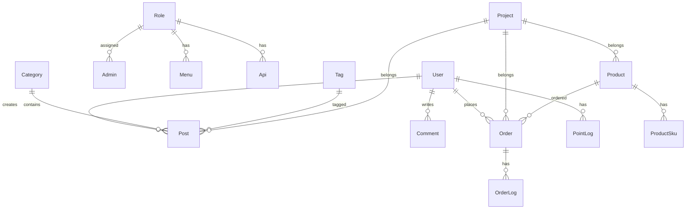

# GoTribe Admin 架构文档

## 系统概述

GoTribe Admin 是一个基于 Go 语言开发的企业级内容管理系统（CMS），采用前后端分离架构，提供完整的后台管理功能。

## 技术栈

### 后端技术
- **语言**: Go 1.20+
- **Web框架**: Gin 1.9.1
- **ORM**: GORM 1.25.8
- **数据库**: MySQL 8.0+ / PostgreSQL 13+
- **权限管理**: Casbin
- **日志**: Zap + Lumberjack
- **配置管理**: Viper
- **任务调度**: Cron
- **文件上传**: 支持本地、OSS、七牛云

### 前端技术
- **框架**: Vue 3
- **UI库**: Element Plus
- **构建工具**: Vite
- **状态管理**: Pinia
- **路由**: Vue Router

## 系统架构

### 整体架构图



### 目录结构

```
gotribe-admin/
├── config/                 # 配置文件
│   ├── config.go          # 配置结构定义
│   └── config.yml         # 配置文件
├── internal/              # 内部包
│   ├── app/              # 应用层
│   │   ├── controller/   # 控制器
│   │   ├── repository/   # 数据访问层
│   │   └── routes/       # 路由定义
│   ├── pkg/              # 内部工具包
│   │   ├── common/       # 通用组件
│   │   ├── middleware/   # 中间件
│   │   └── model/        # 数据模型
│   └── jobs/             # 定时任务
├── pkg/                   # 公共包
│   ├── api/              # API相关
│   │   ├── dto/          # 数据传输对象
│   │   ├── vo/           # 视图对象
│   │   └── response/     # 响应封装
│   └── util/             # 工具函数
├── web/                   # 前端资源
│   └── admin/            # 管理后台前端
├── docs/                  # 文档
├── scripts/               # 脚本
└── public/                # 静态资源
```

## 核心模块

### 1. 用户管理模块
- 用户注册/登录
- 用户信息管理
- 角色权限管理
- 管理员管理

### 2. 内容管理模块
- 文章管理
- 分类管理
- 标签管理
- 专栏管理
- 评论管理

### 3. 项目管理模块
- 项目创建/编辑
- 项目配置
- 项目统计

### 4. 商品管理模块
- 商品管理
- 商品分类
- 商品规格
- 订单管理

### 5. 系统管理模块
- 系统配置
- 菜单管理
- API管理
- 操作日志
- 资源管理

### 6. 积分系统模块
- 积分记录
- 积分扣除
- 积分可用性管理

## 数据库设计

### 核心表结构



### 主要表说明

| 表名 | 说明 | 主要字段 |
|------|------|----------|
| user | 用户表 | user_id, username, email, phone |
| admin | 管理员表 | username, password, mobile, avatar |
| role | 角色表 | name, keyword, desc, sort |
| menu | 菜单表 | name, title, path, component |
| api | API表 | path, method, group, desc |
| post | 文章表 | post_id, title, content, status |
| category | 分类表 | title, description, status |
| tag | 标签表 | title, description |
| project | 项目表 | name, title, description |
| product | 商品表 | product_id, title, description |
| order | 订单表 | order_id, user_id, amount, status |
| point_log | 积分记录表 | user_id, points, reason, type |

## API设计

### RESTful API规范

- **GET** `/api/resource` - 获取资源列表
- **GET** `/api/resource/:id` - 获取单个资源
- **POST** `/api/resource` - 创建资源
- **PUT** `/api/resource/:id` - 更新资源
- **DELETE** `/api/resource/:id` - 删除资源

### 响应格式

```json
{
  "code": 200,
  "message": "success",
  "data": {},
  "timestamp": "2023-01-01T00:00:00Z"
}
```

### 分页格式

```json
{
  "code": 200,
  "message": "success",
  "data": {
    "list": [],
    "total": 100,
    "page": 1,
    "pageSize": 10
  }
}
```

## 安全设计

### 1. 认证机制
- JWT Token认证
- RSA加密传输
- 密码BCrypt加密

### 2. 权限控制
- 基于Casbin的RBAC权限模型
- 菜单级权限控制
- API级权限控制

### 3. 数据安全
- SQL注入防护
- XSS攻击防护
- CSRF攻击防护
- 敏感数据加密存储

### 4. 接口安全
- 请求频率限制
- 参数校验
- 操作日志记录

## 性能优化

### 1. 数据库优化
- 索引优化
- 查询优化
- 连接池配置

### 2. 缓存策略
- Redis缓存
- 查询结果缓存
- 静态资源缓存

### 3. 并发处理
- Goroutine池
- 连接池
- 限流控制

## 部署架构

### 开发环境
```bash
# 本地开发
make run

# 数据库迁移
make migrate

# 初始化数据
make seed
```

### 生产环境
```bash
# 构建
make build

# 部署
make deploy

# 监控
make monitor
```

### Docker部署
```yaml
version: '3.8'
services:
  app:
    build: .
    ports:
      - "8088:8088"
    environment:
      - DB_HOST=mysql
      - DB_PORT=3306
    depends_on:
      - mysql
      - redis

  mysql:
    image: mysql:8.0
    environment:
      MYSQL_ROOT_PASSWORD: password
      MYSQL_DATABASE: gotribe

  redis:
    image: redis:alpine
```

## 监控和日志

### 1. 日志系统
- 结构化日志
- 日志分级
- 日志轮转
- 日志聚合

### 2. 监控指标
- 系统性能指标
- 业务指标
- 错误率监控
- 响应时间监控

### 3. 告警机制
- 错误告警
- 性能告警
- 业务告警

## 扩展性设计

### 1. 插件系统
- 中间件插件
- 业务插件
- 主题插件

### 2. 多租户支持
- 数据隔离
- 配置隔离
- 权限隔离

### 3. 微服务架构
- 服务拆分
- 服务发现
- 负载均衡

## 开发规范

### 1. 代码规范
- Go代码规范
- 注释规范
- 命名规范

### 2. 提交规范
- Git提交规范
- 分支管理
- 代码审查

### 3. 测试规范
- 单元测试
- 集成测试
- 性能测试

## 版本规划

### v1.0.0 (当前版本)
- 基础功能完成
- 用户管理
- 内容管理
- 系统管理

### v1.1.0 (计划中)
- 商品管理完善
- 支付集成
- 多语言支持

### v1.2.0 (计划中)
- 插件系统
- 主题系统
- 多租户支持

## 贡献指南

### 1. 开发环境搭建
- 安装Go 1.20+
- 安装MySQL/PostgreSQL
- 安装Redis
- 克隆项目

### 2. 开发流程
- Fork项目
- 创建功能分支
- 提交代码
- 创建Pull Request

### 3. 代码审查
- 代码质量检查
- 功能测试
- 性能测试
- 安全审查

## 许可证

本项目采用 MIT 许可证，详见 [LICENSE](LICENSE) 文件。
