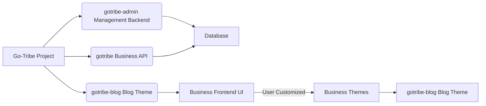

[English](README.md) | [中文](README_CN.md)

---
<h1 align="center">gotribe-admin</h1>

<div align="center">
`gotribe-admin` is a small CMS solution developed with Go and Vue, featuring a rich set of themes, ready-to-use out of the box, and an enterprise-level architecture. It is suitable for individuals, teams, and small to medium-sized enterprises.
<p align="center">


</p>
</div>

### Core Advantages

- **Performance**: Leveraging Golang's efficient concurrency capabilities, GoTribe can easily handle the demands of high-traffic websites.
- **Ease of Use**: With a clean and intuitive user interface and documentation, even beginners can get started quickly.
- **Highly Customizable**: Offers a wealth of APIs and plugin support to meet personalized website building needs.
- **Community Support**: An active open-source community provides ongoing updates and technical support.
- **Security and Stability**: Adheres to best security practices to ensure the safety and stable operation of website data.

### Applicable Scenarios

GoTribe provides robust support and flexible customization options for everything from personal blogs and team projects to enterprise websites.

### Demo


### Project Description

The project adopts a front-end and back-end separation architecture, consisting of three parts: the management API, the business API, and the management backend UI. The business front-end UI can be developed according to your needs or using our templates.

#### Projects

| Project              | Description  | Address                             |
|----------------------|--------------|--------------------------------------|
| **gotribe-admin**    | Management API| [Link](https://github.com/go-tribe/gotribe-admin.git) |
| **gotribe**          | Business API | [Link](https://github.com/go-tribe/gotribe.git)     |
| **gotribe-admin-vue**| Management UI | [Link](https://github.com/go-tribe/gotribe-admin-vue.git) |

#### Business Themes

| Theme             | Description    | Address                                      |
|-------------------|----------------|----------------------------------------------|
| **gotribe-blog**  | A simple blog theme | [Link](https://github.com/go-tribe/gotribe-blog.git) |

#### Relationship Diagram



The diagram above clearly illustrates the structure of the Go-Tribe project and the interactions between its components:

- **Go-Tribe** is the name of the entire system framework, which includes multiple modules, each responsible for different functions.
- **gotribe-admin Management Backend**: This is the core management module of the system, used for handling backend management tasks. For security reasons, it is usually deployed on an internal network and accessed via VPN. To simplify the deployment process, we have integrated the gotribe-admin-vue Management UI with the Management API for one-click deployment.
- **gotribe Business API**: This module is responsible for handling business logic, with a particular focus on search engine optimization (SEO) and development efficiency. It is completely decoupled from the business frontend UI and supports Kubernetes deployment and horizontal scaling to accommodate the needs of businesses of different sizes.
- **gotribe-blog Blog Theme**: Provides a pre-built blog theme as an example of a business theme, demonstrating how to quickly build specific business scenarios using the Go-Tribe framework.
- **Database**: Serves as the data storage center of the system, responsible for saving all necessary data.
- **Business Frontend UI**: Users can develop customized frontend interfaces according to their specific needs, using templates provided by Go-Tribe.

The entire system is designed with a front-end and back-end separation architecture, which not only improves the system's flexibility but also allows each component to be developed and maintained independently, thereby enhancing the system's scalability and maintainability.

### Quick Start

> Prerequisites: `go1.21+` `node 18+` `mysql 8.0+` or `postgresql 13+` `redis 6.0+`

1. **Clone the project**

```bash
git clone https://github.com/go-tribe/gotribe-admin.git
cd gotribe-admin
```

2. **Install dependencies**

```bash
# Install Go dependencies
go mod tidy

# Install frontend dependencies (if needed)
cd web/admin
npm install
cd ../..
```

3. **Configure the environment**

```bash
# Copy configuration template
cp config.tmp.yml config.yml

# Edit configuration file
vim config.yml
```

4. **Start services**

```bash
# Using Docker Compose (recommended)
docker-compose up -d

# Or start manually
# Start MySQL/PostgreSQL and Redis
# Then run the application
make run
```

5. **Access the application**

- Management Backend: http://localhost:8088
- Default username: `admin`
- Default password: `123456`

### Development

```bash
# Run in development mode
make run

# Run tests
make test

# Run tests with coverage
make test-coverage

# Format code
make fmt

# Lint code
make lint

# Build
make build

# Clean
make clean
```

### Docker

```bash
# Build Docker image
make docker

# Run with Docker Compose
make docker-run

# Stop containers
make docker-stop

# Clean up
make docker-clean
```

### Features

- **User Management**: Complete user registration, login, and profile management
- **Content Management**: Articles, categories, tags, columns, and comments
- **Project Management**: Multi-project support with independent configurations
- **Product Management**: Product catalog, SKU management, and order processing
- **Point System**: Integrated points and rewards system
- **System Management**: Menu, role, API, and configuration management
- **Resource Management**: File upload with support for local, OSS, and Qiniu storage
- **Permission Control**: RBAC-based permission system using Casbin
- **Operation Logs**: Comprehensive audit trail
- **Rate Limiting**: Built-in request rate limiting
- **Multi-Database Support**: MySQL and PostgreSQL support
- **Docker Support**: Complete containerization
- **RESTful API**: Well-documented API endpoints
- **Admin UI**: Modern Vue.js-based management interface

### Documentation

- [API Documentation](API.md) - Complete API reference
- [Architecture Guide](ARCHITECTURE.md) - System architecture and design
- [Contributing Guide](CONTRIBUTING.md) - How to contribute to the project
- [Security Guide](SECURITY.md) - Security best practices
- [Changelog](CHANGELOG.md) - Version history and changes

### Community

- [Issues](https://github.com/go-tribe/gotribe-admin/issues) - Bug reports and feature requests
- [Discussions](https://github.com/go-tribe/gotribe-admin/discussions) - Community discussions
- [Releases](https://github.com/go-tribe/gotribe-admin/releases) - Latest releases

### Roadmap

- [ ] Payment system integration
- [ ] Multi-language support
- [ ] Theme system
- [ ] Plugin system
- [ ] Multi-tenant support
- [ ] Microservices architecture
- [ ] Performance optimization
- [ ] Security enhancements

### Online Demo

[Mafan](https://www.dengmengmian.com) - Live demo of the system

### License

[MIT](https://choosealicense.com/licenses/mit/) - See [LICENSE](LICENSE) file for details

### Contributing

We welcome contributions! Please see our [Contributing Guide](CONTRIBUTING.md) for details.

### Support

If you find this project helpful, please give it a ⭐️ on GitHub!

---
