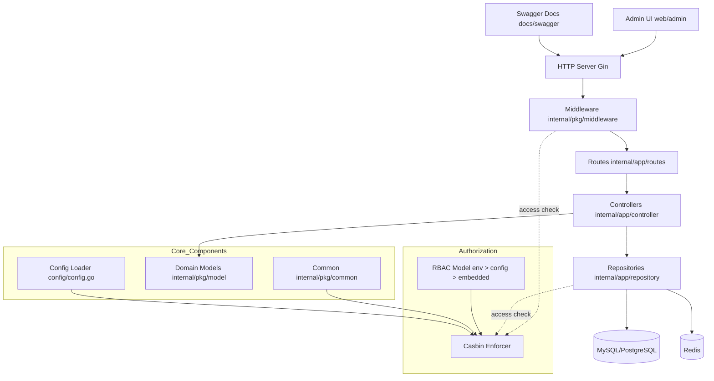

[English](#english) | [中文](docs/guides/README_CN.md)

# gotribe-admin

## English

### Overview
gotribe-admin is a production-grade Go backend for admin systems. It features a clean layered architecture, Casbin-based RBAC with an external-first and built-in-fallback model strategy, Swagger-based API documentation, and practical tooling for CI/CD and containerized deployment.

### Highlights
- Dual-track RBAC model loading: environment `RBAC_MODEL_PATH` → config `casbin.model-path` → embedded default.
- Layered architecture: controllers, repositories, routes, middleware, common utilities, models.
- API documentation with Swagger under `docs/swagger/`.
- Predictable configuration via `config/config.go` and `config/config.tmp.yml`.
- Shipping-friendly: `Makefile`, Docker, and GoReleaser.

### Quick Start
- Requirements: Go (version declared in `go.mod`), make.
- Install deps: `go mod download`.
- Build: `make build` (or `go build ./...`).
- Run: `go run gotribe-admin.go`.
- Test: `go test ./...`.
- Verify locally: `make verify`.
- Optional: `docker compose up -d` for containerized services if configured.

### Configuration
- Base configuration template: `config/config.tmp.yml`.
- The app can start from `config.yml`, from environment variables, or a mix of both.
- Environment variables override file values. Common examples: `SYSTEM_MODE`, `SYSTEM_HOST`, `SYSTEM_PORT`, `DATABASE_HOST`, `DATABASE_PORT`, `DATABASE_USERNAME`, `DATABASE_PASSWORD`, `DATABASE_DATABASE`, `DATABASE_TYPE`, `JWT_KEY`, `JWT_TOKEN_LOOKUP`.
- Default bind host is `0.0.0.0`; the dedicated health endpoint is `/health`.
- See `config/config.go` for loading order and defaults.

Example:
```bash
cp config/config.tmp.yml config.yml

export SYSTEM_MODE=release
export SYSTEM_HOST=0.0.0.0
export DATABASE_HOST=127.0.0.1
export DATABASE_PORT=3306
export DATABASE_USERNAME=gotribe
export DATABASE_PASSWORD=change_me
export DATABASE_DATABASE=gotribe
export DATABASE_TYPE=mysql
export JWT_KEY=replace_with_a_random_secret
```

### Security Defaults
- JWT tokens are read from `Authorization` header and `query` by default. Cookie-based token lookup is disabled by default.
- CORS uses an allowlist. In non-release mode, localhost origins are allowed for development; in release mode, configure `cors.allowed-origins` explicitly.
- Review `config/config.tmp.yml` before production use and replace all placeholder secrets.

### RBAC Model Configuration
This project uses Casbin for RBAC with an external-first, built-in-fallback strategy:
- External override via environment: set `RBAC_MODEL_PATH` to the absolute path of your `rbac_model.conf`.
- Or configure in `config.yml`: set `casbin.model-path`.
- If no valid external path is provided, the app falls back to an embedded default RBAC model.
- On startup, logs indicate whether the model was loaded from an external file or the embedded default.

Example:
```bash
# Highest priority: environment variable
export RBAC_MODEL_PATH=/etc/gotribe/rbac_model.conf

# Or via config.yml (lower priority than environment)
# casbin:
#   model-path: ./rbac_model.conf
```

### Architecture
High-level flow and responsibilities:
- Request → middleware → routes → controller → repository → database/domain.
- Authorization decisions leverage a Casbin enforcer during middleware and/or repository access checks.

Architecture diagram:

```mermaid
graph TD;
  Client[Admin UI web/admin] --> HTTP[HTTP Server Gin];
  Docs[Swagger Docs docs/swagger] --> HTTP;

  HTTP --> MW[Middleware internal/pkg/middleware];
  MW --> Routes[Routes internal/app/routes];
  Routes --> Ctrl[Controllers internal/app/controller];
  Ctrl --> Repo[Repositories internal/app/repository];
  Repo --> DB[(MySQL/PostgreSQL)];
  Repo --> Cache[(Redis)];

  subgraph Authorization
    Enforcer[Casbin Enforcer]
    ModelSrc[RBAC Model env > config > embedded]
  end

  MW -. access check .-> Enforcer;
  Repo -. access check .-> Enforcer;
  ModelSrc --> Enforcer;

  subgraph Core_Components
    Common[Common internal/pkg/common]
    Domain[Domain Models internal/pkg/model]
    Config[Config Loader config/config.go]
  end

  Common --> Enforcer;
  Config --> Enforcer;
  Ctrl --> Domain;
```

Project structure (selected):
```
├── .github/                      # Contributing and CI workflows
├── config/                       # Config loader and templates
│   ├── config.go                 # Programmatic configuration
│   └── config.tmp.yml            # Example configuration
├── docs/                         # Documentation index, guides, reference, swagger
│   ├── README.md                 # Docs index
│   ├── guides/                   # Architecture and how-to guides
│   ├── reference/                # API and changelog
│   └── swagger/                  # Generated swagger files
├── internal/
│   ├── app/
│   │   ├── controller/           # HTTP handlers / business orchestration
│   │   ├── jobs/                 # Background jobs / schedulers
│   │   ├── repository/           # Data access layer
│   │   └── routes/               # Route registration
│   └── pkg/
│       ├── common/               # Shared components (e.g., Casbin initialization)
│       ├── middleware/           # HTTP middleware (auth, logging, etc.)
│       └── model/                # Domain models / DTOs
├── pkg/
│   ├── api/                      # API DTOs, response types, VO
│   └── util/                     # Utilities (bcrypt, json, seo, time, upload)
├── public/                       # Static assets served by the app
├── scripts/                      # DB init and boilerplate
├── web/admin/                    # Admin frontend (if present)
├── gotribe-admin.go              # Application entrypoint
├── rbac_model.conf               # Optional external RBAC model file
├── LICENSE                       # Project license
├── SECURITY.md                   # Security policy
└── Makefile                      # Common build and utility targets
```

### API & Docs
- Docs index: `docs/README.md`.
- Swagger: `docs/swagger/` hosts `swagger.json` and `swagger.yaml`.
- Architecture guide (CN): `docs/guides/ARCHITECTURE.md`.
- Chinese overview: `docs/guides/README_CN.md`.

### Development
- Follow Go conventions for formatting and testing.
- Run unit tests: `go test ./...`.
- Consider adding CI link checks for Markdown (e.g., `markdown-link-check`).

### Security & License
- Security policy: `SECURITY.md`.
- License: `LICENSE`.

---

## Documentation
- Docs index: [docs/README.md](docs/README.md)
  - Guides: `docs/guides/`
  - Reference: `docs/reference/`
  - Swagger: `docs/swagger/`
