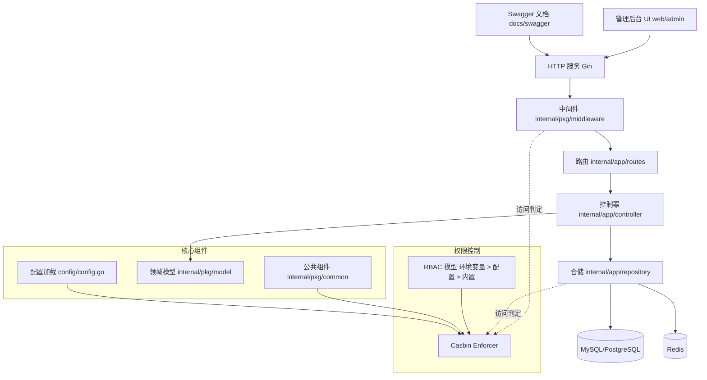

[English](../../README.md) | [中文](README_CN.md)

# gotribe-admin

### 概览
gotribe-admin 是一个面向生产环境的 Go 管理后台项目，提供清晰的分层架构、基于 Casbin 的 RBAC 权限模型（外部优先 + 内置回退）、Swagger API 文档，以及兼容 CI/CD 的构建与发布工具链。

### 特性
- RBAC 双轨加载：环境变量 `RBAC_MODEL_PATH` → 配置 `casbin.model-path` → 内置默认模型。
- 分层架构：控制器、仓储、路由、中间件、公共组件、模型等职责清晰。
- API 文档：`docs/swagger/` 下的 Swagger 文件。
- 配置清晰：`config/config.go` 与 `config.tmp.yml`。
- 交付友好：`Makefile`、Docker、GoReleaser。

### 快速开始
- 依赖：Go（版本见 `go.mod`）、make。
- 安装依赖：`go mod download`。
- 构建：`make build`（或 `go build ./...`）。
- 运行：`go run gotribe-admin.go`。
- 测试：`go test ./...`。
- 可选：如需容器化，执行 `docker-compose up -d`（取决于环境配置）。

### 配置
- 示例配置文件：`config/config.tmp.yml`。
- 环境变量可覆盖配置文件的相关值。
- 加载顺序与默认值见 `config/config.go`。

### RBAC 模型配置
项目使用 Casbin 实现 RBAC，采用“外部优先 + 内置回退”的加载策略：
- 通过环境变量覆盖：设置 `RBAC_MODEL_PATH` 为你的 `rbac_model.conf` 的绝对路径。
- 或在配置文件中设置：`casbin.model-path`。
- 若未提供有效的外部路径，系统回退到内置的默认 RBAC 模型。
- 启动时会在日志中标识模型来源（外部文件或内置默认）。

示例：
```bash
# 优先级最高：环境变量
export RBAC_MODEL_PATH=/etc/gotribe/rbac_model.conf

# 或通过 config.yml（优先级低于环境变量）
# casbin:
#   model-path: ./rbac_model.conf
```

### 架构
调用流程与职责分层：
- 请求 → 中间件 → 路由 → 控制器 → 仓储 → 数据库/领域模型。
- 授权逻辑通过 Casbin enforcer 在中间件与/或仓储层进行访问控制判定。

架构图：


项目结构（精选）：
```
├── .github/                      # 贡献与 CI 工作流
├── config/                       # 配置加载与模板
├── docs/                         # 文档索引、指南、参考与 swagger
├── internal/
│   ├── app/                      # 控制器、任务、仓储、路由
│   └── pkg/                      # 中间件、公共组件、模型
├── pkg/                          # API DTO/响应类型与工具库
├── public/                       # 静态资源
├── scripts/                      # 初始化脚本
├── web/admin/                    # 后台前端（如果存在）
├── gotribe-admin.go              # 程序入口
├── rbac_model.conf               # 可选的外部 RBAC 模型文件
├── LICENSE                       # 许可证
├── SECURITY.md                   # 安全策略
└── Makefile                      # 构建与常用目标
```

### API 与文档
- 文档索引：[`docs/README.md`](../README.md)。
- Swagger：[`docs/swagger/`](../swagger/) 下的 `swagger.json` 与 `swagger.yaml`。
- 架构指南（中文）：[`docs/guides/ARCHITECTURE.md`](ARCHITECTURE.md)。

### 开发
- 遵循 Go 常规格式化与测试。
- 运行单元测试：`go test ./...`。
- 建议在 CI 中加入 Markdown 链接检查（如 `markdown-link-check`）。

### 安全与许可
- 安全策略：[`SECURITY.md`](../../SECURITY.md)。
- 许可证：[`LICENSE`](../../LICENSE)。
